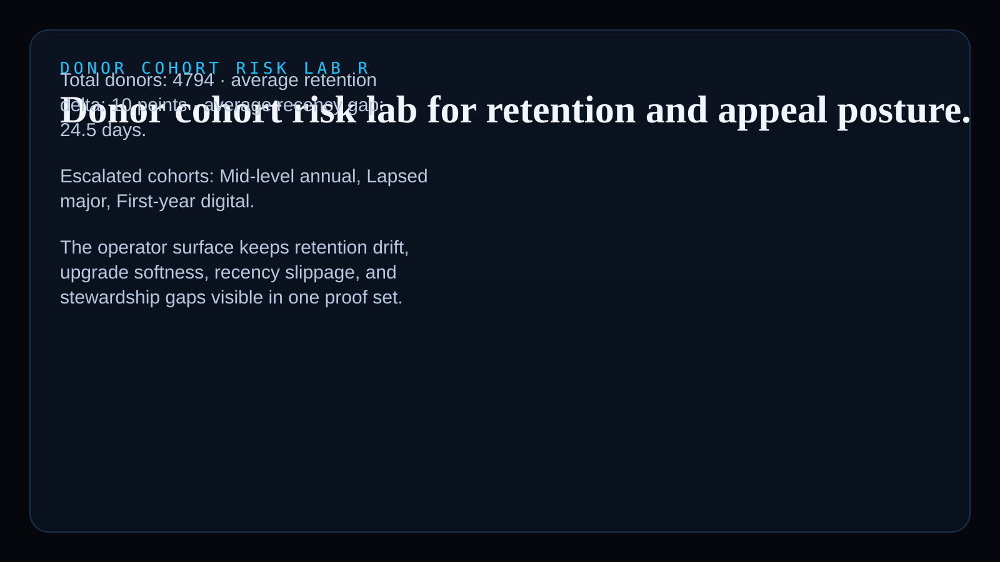
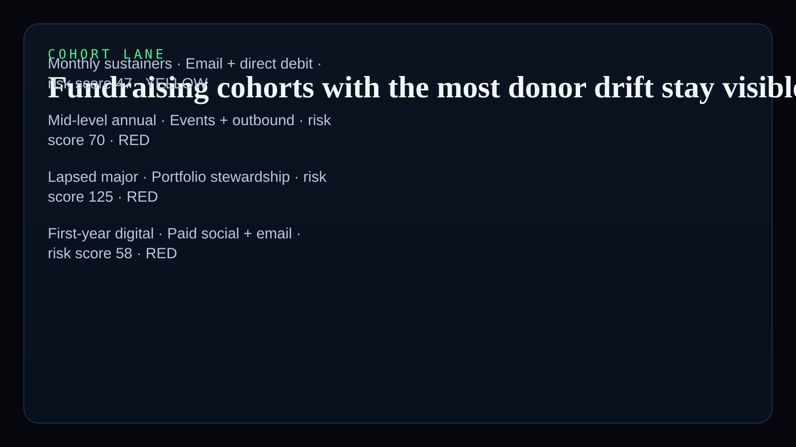
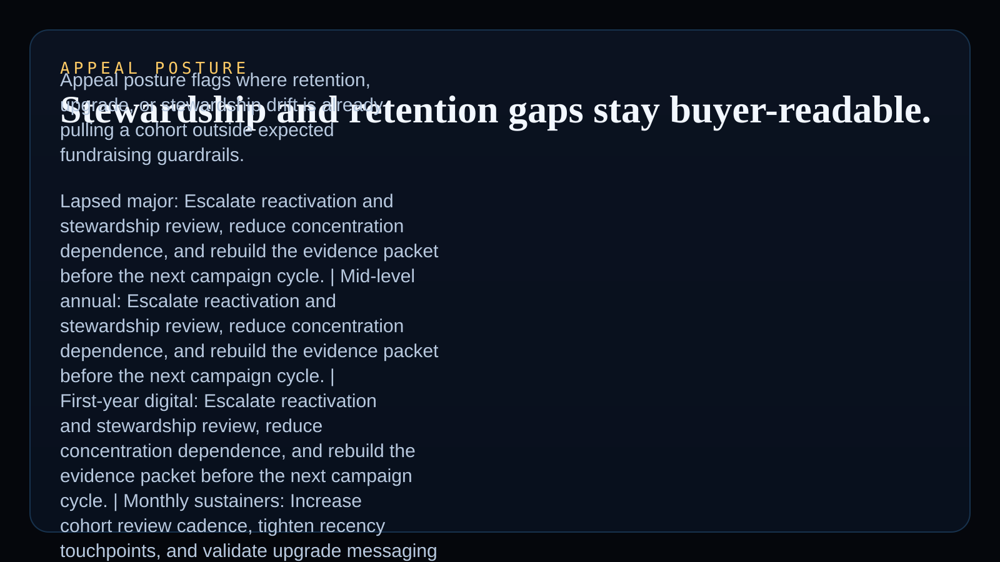
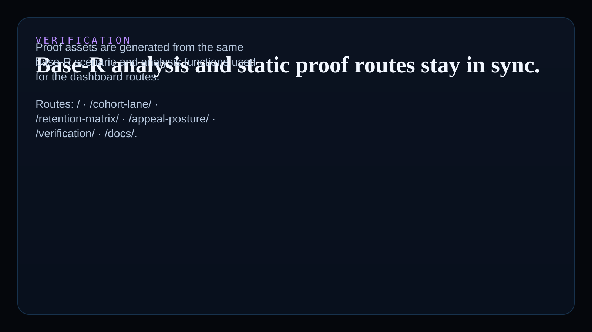

# donor-cohort-risk-lab-r

Base-R operator surface for nonprofit, foundation, and mission-driven growth teams reviewing donor retention drift, upgrade softness, recency slippage, and stewardship gaps with synthetic demonstration data.

## What it shows

- real `R` added to the public Kinetic Gain language atlas for donor and audience-risk analysis
- a nonprofit / foundation-ops vertical proof that is statistical, not just dashboard-wrapped
- monetizable donor-health packets, appeal review templates, and fundraising evidence consulting hooks

## Screenshots






## Routes

- `/`
- `/cohort-lane/`
- `/retention-matrix/`
- `/appeal-posture/`
- `/verification/`
- `/docs/`

## Local development

```powershell
& 'C:\Program Files\R\R-4.6.0\bin\Rscript.exe' scripts\run_demo.R
& 'C:\Program Files\R\R-4.6.0\bin\Rscript.exe' scripts\generate_site.R
```

## Validation

```powershell
& 'C:\Program Files\R\R-4.6.0\bin\Rscript.exe' test\runtests.R
& 'C:\Program Files\R\R-4.6.0\bin\Rscript.exe' scripts\smoke_check.R
& 'C:\Program Files\R\R-4.6.0\bin\Rscript.exe' scripts\render_readme_assets.R
```

## Safety note

This repo uses synthetic demonstration data only. It does not contain real donor records or claim nonprofit compliance certification, audit readiness, or CRM production fitness.

## Why this matters

Kinetic Gain Embedded tie-back:

This repo proves Kinetic Gain can ship statistical donor-cohort operator surfaces in `R`, not just generic RevOps wrappers. The same base-R analysis drives cohort routes, appeal posture, smoke checks, and proof assets, which makes the language-atlas signal real.

## Product depth

This surface is meant for fundraising, stewardship, and nonprofit leadership teams that need to explain donor health without hiding behind CRM exports. It shows where retention drift, upgrade softness, recency slippage, and unresolved stewardship gaps are putting the next appeal cycle at risk.

For technical reviewers, the public proof is reproducible. One base-R analysis path creates cohort scores, the action queue, static routes, sitemap, README proof assets, and smoke-testable HTML.

For GTM and diligence use, the repo can ladder into donor-health review packets, appeal-risk templates, stewardship recovery briefs, and embedded growth-operations work for foundations and mission-driven teams.

## What these repos have in common

Kinetic Gain repos use the same operating pattern: name the risk, attach an owner-readable evidence view, expose the next action, and keep public proof close enough to implementation that the claim can be inspected.

This repo applies that pattern to donor retention and stewardship. The broader portfolio applies it to payments, KYC, grants, CAPA, diagnostics, care variation, cloud, identity, and revenue systems, but the product shape is consistent: turn messy operating complexity into a board-ready and operator-usable control plane.

## Operating workflow

1. Load synthetic donor-cohort and fundraising-motion data.
2. Compare expected versus actual retention, upgrade, recency, and stewardship posture.
3. Score each cohort for appeal and donor-health risk.
4. Build a prioritized review queue with fundraising recommendations.
5. Render static buyer-facing routes and README proof assets from the same analysis.
6. Validate with tests and smoke checks before release.

## Commercial path

- `Template pack planned`
- `Consulting hook`

This can ladder into donor cohort review packets, fundraising retention decks, stewardship evidence packs, and embedded nonprofit growth-operations work for foundations and mission-driven teams.

---

Part of the [Kinetic Gain operator portfolio](https://kineticgain.com/) · docs: [suite.kineticgain.com](https://suite.kineticgain.com/) · live: [donors.kineticgain.com](https://donors.kineticgain.com/)
